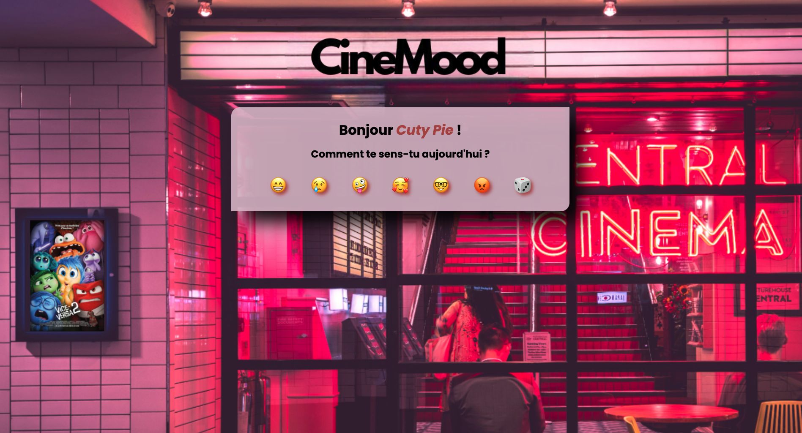
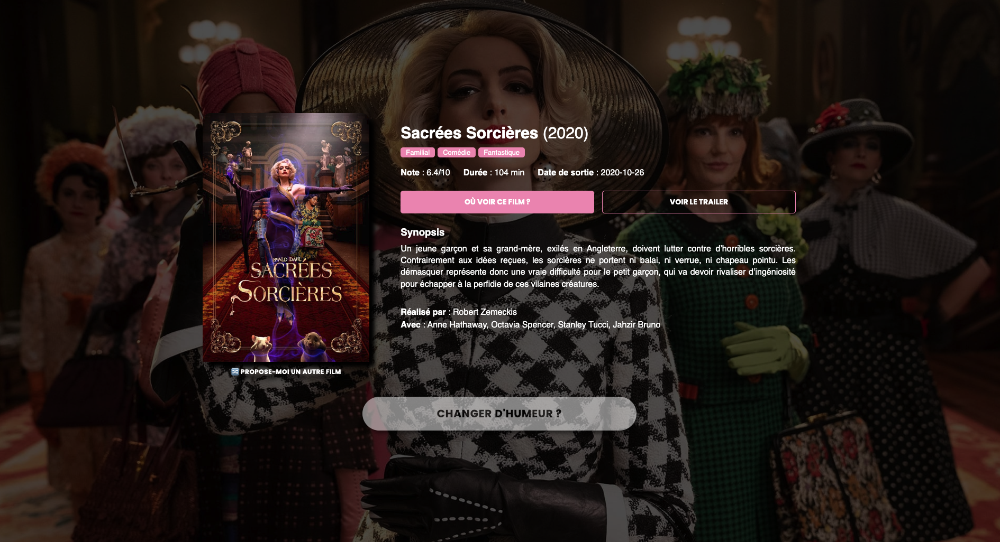
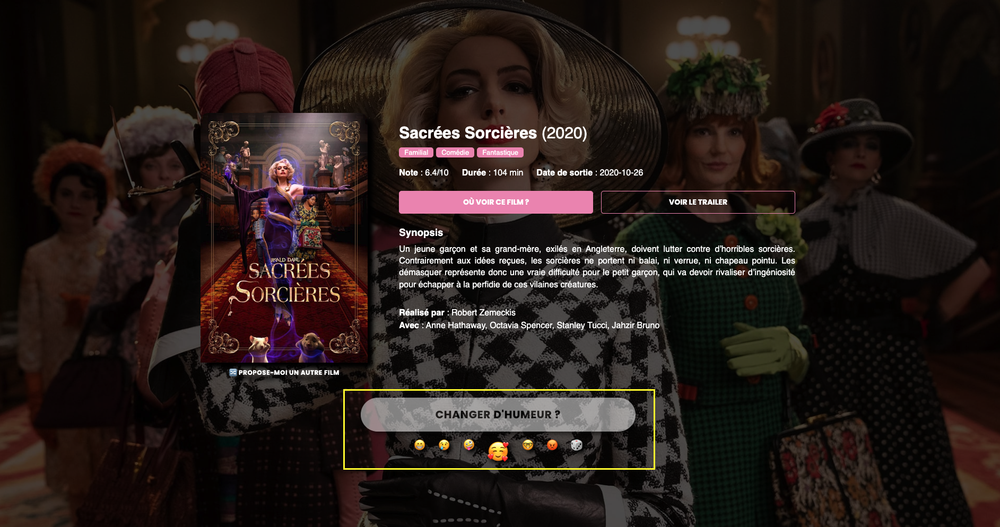

# CINEMOOD

Cinemood is a website that will help you find a movie regarding your actual mood. Don't worry, you can always ask for another suggestion or even change your mood.

## Table of contents

- [Project Status](#project-status)
- [Overview](#overview)
  - [The challenge](#the-challenge)
  - [Screenshot](#screenshot)
  - [Links](#links)
- [Our process](#my-process)
  - [Built with](#built-with)
  - [Useful resources](#useful-resources)
- [Authors & acknowledgments](#authors-and-acknowledgments)

## Project Status
This project is a indefinitly work in progress. We started it as a collective school assesment and the three of us are now working on others projects. 
Feel free to fork this project or let us know if you'd like to take it to another level. 

This project is not responsive.

## Overview

### The challenge

- Create a website that uses an API
- Learn to fetch data from an API
- Learn how to work with GitHub in order to share our work with our teammates 
- Get an MVP ready in 10 days

### Screenshots

### Links

- Git Pages : [CineMood](https://nejih.github.io/cinemood/)

## Our process

### Built with

- Semantic HTML5 markup
- CSS custom properties
- Flexbox
- Web design properties
- JS Vanilla
- [TMDB](https://www.themoviedb.org/) API
- GitHub

### Useful resources

- [Pokemon API Tutorial](https://youtu.be/V_cMYN3jAjg?si=GB-3vID6IHqMysfd) - This video is the first step we all took in order to understand what was a fetch and how to use an API.

## Authors and acknowledgment

- GitHub : 
 . [Arnaud](https://github.com/NejiH/)
 . [Anais](https://github.com/anaisrandria)
 . [Moussa](https://github.com/moustik2/)
